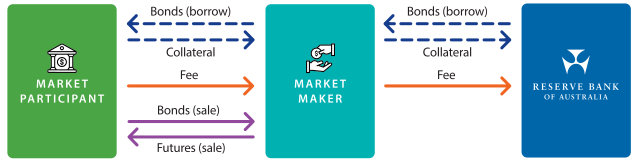
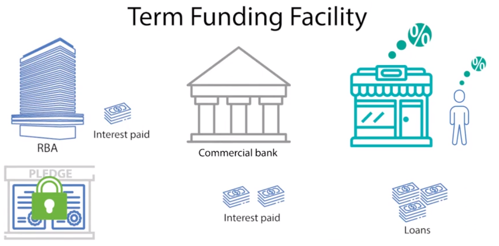

## October 2025 - Bond Futures Liquidity


In October 2025, Richard Finlay, Dmitry Titkov and I put out an RBA Research Discussion Paper: [*Back to the Futures: Liquidity in Australian Bond Futures amid Market-moving Events since COVID-19*](https://www.rba.gov.au/publications/rdp/2025/2025-07.html). Richard and Dmitry did the heavy lifting here — I was just glad to be able to contribute in during a period where I took 8 months of parental leave!

The Australian Government Securities (AGS) futures market is one of Australia's key venues for trading interest rate risk, with turnover that substantially exceeds trading in AGS themselves. Using tick-level data covering every trade and order book updates from 2019 to 2025, we examined how liquidity in this market responds to different types of market-moving events.

I'll leave the key results to the abstract linked above. But the figured I've pulled illustrates one of the simple pleasures of detailed data. Averaging more than five years of 5-minute turnover observations makes the structure of the trading day immediately legible: activity picks up as the Sydney session opens at 08:30, dips at lunch, rises again as European markets come online in the late afternoon, and falls away overnight and into the early evening - the data tells such a clear story about the near-24 hour trading in AGS futures.

The paper was presented at the Australian Banking and Finance Conference in December 2025 and received the ASX Award for Best Paper on Derivatives.

------------------------------------------------------------------------

## December 2022 - Securities Lending



In 2022 my colleague Ahmet Aziz and I wrote in the RBA Bulletin about the [AOFM and RBA's securities lending](https://www.rba.gov.au/publications/bulletin/2022/dec/the-rba-and-aofm-securities-lending-facilities.html), which had grown to very large levels - we lent more than AUD$1 trillion in bonds to the market in 2022 (albeit in quite short tenor repo). We wrote about the purpose and design of the securities lending facility, why usage was so high, and a stylised example of the shorts in the bonds-futures basis that were underlying lots of the borrowing. 

## August 2021 - Use of the TFF


<!-- Useful example of code links -->
<!-- <a href="https://arxiv.org/abs/2210.07278" target="_blank">arXiv Preprint</a> \| <a href="https://github.com/marvinschmitt/MetaUncertaintyPaper" target="_blank">Code</a><br> -->

In August 2021 we provided an update in the *Statement on Monetary Policy* on usage of the Term Funding Facility (more detail see below). This outlined how most of the funding available under the TFF was drawn down, and includes a table of the top 10 biggest borrowers.

------------------------------------------------------------------------

## December 2020 - The Term Funding Facility


<a href="https://arxiv.org/abs/2112.08866" target="_blank">arXiv Preprint</a> \| <a href="https://github.com/marvinschmitt/ModelMisspecificationBF" target="_blank">Code</a><br>

In December 2020, my colleagues and I put out an article in the RBA Bulletin on the [Term Funding Facility](https://www.rba.gov.au/publications/bulletin/2020/dec/the-term-funding-facility.html). It outlined the purpose and design of the TFF, as well as how it had been used to date. I had spent the early months of the pandemic setting up the TFF, and I learnt a lot about facility design in the process. 

<!-- Useful example of HTML Button - use Ctrl-Shift-C to uncomment this block -->
<!-- ```{=html} -->
<!-- <div  style="margin: 30px; text-align: center;"> -->
<!-- <a class="btn btn-primary" href="https://www.marvinschmitt.com/blog/website-tutorial-quarto/" role="button" target="_blank" style="padding: 15px 30px;">View the tutorial for this template (+ download link)</a> -->
<!-- </div> -->
<!-- ``` -->
