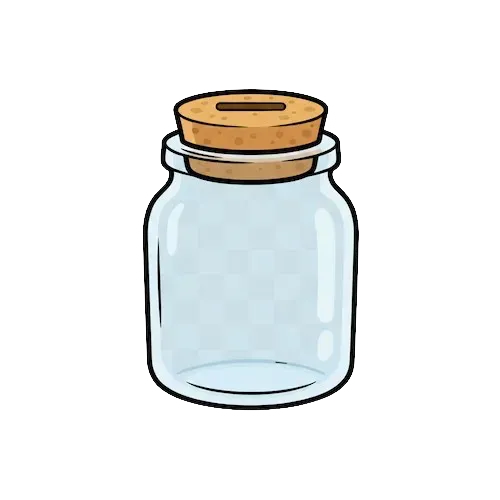

My wife and I have potty-mouths. With a toddler learning new words every day, we need an incentive to keep our words family-friendly. This is the Swear Jar. Only my wife and I can put a coin in the jar - but you can see our latest naughty words below. 

```{=html}
<style>
  /* ---- Layout ---- */
  .swearjar-app {
    max-width: 600px;
    margin: 0 auto;
    padding: 1rem;
    font-family: inherit;
  }

  .jars-container {
    display: grid;
    grid-template-columns: 1fr 1fr;
    gap: 1.5rem;
    margin-bottom: 1.5rem;
  }

  .jar {
    text-align: center;
    padding: 1.5rem 1rem;
    border-radius: 20px;
    background: linear-gradient(145deg, #ffffff, #f0f1f3);
    border: none;
    box-shadow: 0 2px 12px rgba(0, 0, 0, 0.06), 0 1px 3px rgba(0, 0, 0, 0.04);
    transition: transform 0.2s ease, box-shadow 0.2s ease;
  }

  .jar:hover {
    transform: translateY(-2px);
    box-shadow: 0 6px 20px rgba(0, 0, 0, 0.08), 0 2px 6px rgba(0, 0, 0, 0.04);
  }

  .jar-name {
    font-size: 1.3rem;
    font-weight: 700;
    margin-bottom: 0.25rem;
    color: #2d3436;
  }

  .jar-img {
    width: 150px;
    height: 150px;
    object-fit: contain;
    display: block;
    margin: 0.5rem auto;
    transition: transform 0.2s cubic-bezier(0.34, 1.56, 0.64, 1);
  }

  .jar-img.pop {
    transform: scale(1.3) rotate(-5deg);
  }

  .jar-count {
    font-size: 2.2rem;
    font-weight: 800;
    color: #d63384;
    margin-bottom: 0.75rem;
    letter-spacing: -0.02em;
  }

  .swear-btn {
    display: inline-block;
    padding: 0.65rem 1.5rem;
    border: none;
    border-radius: 10px;
    background: linear-gradient(135deg, #d63384, #c2255c);
    color: white;
    font-size: 1rem;
    font-weight: 600;
    cursor: pointer;
    box-shadow: 0 2px 8px rgba(214, 51, 132, 0.3);
    transition: all 0.15s ease;
  }

  .swear-btn:hover {
    background: linear-gradient(135deg, #c2255c, #a61e4d);
    box-shadow: 0 4px 14px rgba(214, 51, 132, 0.4);
    transform: translateY(-1px);
  }

  .swear-btn:active {
    transform: scale(0.96) translateY(0);
    box-shadow: 0 1px 4px rgba(214, 51, 132, 0.3);
  }

  .swear-btn:disabled {
    opacity: 0.5;
    cursor: not-allowed;
    box-shadow: none;
  }

  /* ---- Note input ---- */
  .note-section {
    margin-bottom: 1.5rem;
  }

  .note-input {
    width: 100%;
    padding: 0.6rem 0.85rem;
    border: none;
    border-radius: 10px;
    font-size: 0.95rem;
    box-sizing: border-box;
    background: #f0f1f3;
    box-shadow: inset 0 1px 3px rgba(0, 0, 0, 0.06);
    transition: box-shadow 0.2s ease, background 0.2s ease;
  }

  .note-input:focus {
    outline: none;
    background: #fff;
    box-shadow: inset 0 1px 3px rgba(0, 0, 0, 0.06), 0 0 0 3px rgba(214, 51, 132, 0.15);
  }

  .note-input::placeholder {
    color: #adb5bd;
  }

  /* ---- Settlement ---- */
  .settlement-box {
    background: linear-gradient(145deg, #ffffff, #f0f1f3);
    border: none;
    border-radius: 16px;
    padding: 1.1rem 1.25rem;
    margin-bottom: 1.5rem;
    text-align: center;
    box-shadow: 0 2px 12px rgba(0, 0, 0, 0.06), 0 1px 3px rgba(0, 0, 0, 0.04);
  }

  .settlement-box .owes {
    font-size: 1.1rem;
    font-weight: 600;
    margin-bottom: 0.75rem;
    color: #2d3436;
  }

  .settle-btn {
    padding: 0.5rem 1.25rem;
    border: none;
    border-radius: 10px;
    background: linear-gradient(135deg, #198754, #157347);
    color: white;
    font-size: 0.95rem;
    font-weight: 600;
    cursor: pointer;
    box-shadow: 0 2px 8px rgba(25, 135, 84, 0.3);
    transition: all 0.15s ease;
  }

  .settle-btn:hover {
    background: linear-gradient(135deg, #157347, #0f5132);
    box-shadow: 0 4px 14px rgba(25, 135, 84, 0.35);
    transform: translateY(-1px);
  }

  .settle-btn:disabled {
    opacity: 0.5;
    cursor: not-allowed;
    box-shadow: none;
  }

  /* ---- History ---- */
  .history-section {
    margin-bottom: 1.5rem;
  }

  .history-section h3 {
    margin-bottom: 0.5rem;
    font-size: 1.1rem;
    color: #2d3436;
  }

  .history-list {
    max-height: 300px;
    overflow-y: auto;
    border: none;
    border-radius: 12px;
    padding: 0;
    margin: 0;
    list-style: none;
    background: linear-gradient(145deg, #ffffff, #f8f9fa);
    box-shadow: 0 2px 12px rgba(0, 0, 0, 0.06), 0 1px 3px rgba(0, 0, 0, 0.04);
  }

  .history-list li {
    padding: 0.6rem 0.85rem;
    border-bottom: 1px solid rgba(0, 0, 0, 0.04);
    font-size: 0.9rem;
    transition: background 0.15s ease;
  }

  .history-list li:hover {
    background: rgba(0, 0, 0, 0.015);
  }

  .history-list li:last-child {
    border-bottom: none;
  }

  .history-list .person-tag {
    font-weight: 700;
    color: #2d3436;
  }

  .history-list .note-text {
    color: #6c757d;
    font-style: italic;
  }

  .history-list .time-text {
    color: #adb5bd;
    font-size: 0.8rem;
  }

  .history-list .entry-actions {
    float: right;
    display: inline-flex;
    gap: 0.25rem;
  }

  .history-list .entry-actions button {
    background: none;
    border: none;
    cursor: pointer;
    font-size: 0.85rem;
    padding: 0 0.2rem;
    opacity: 0.35;
    transition: opacity 0.15s;
  }

  .history-list .entry-actions button:hover {
    opacity: 1;
  }

  .history-list .edit-inline {
    display: flex;
    gap: 0.3rem;
    margin-top: 0.4rem;
  }

  .history-list .edit-inline input {
    flex: 1;
    padding: 0.25rem 0.5rem;
    border: none;
    border-radius: 6px;
    font-size: 0.85rem;
    background: #f0f1f3;
    box-shadow: inset 0 1px 2px rgba(0, 0, 0, 0.06);
  }

  .history-list .edit-inline button {
    padding: 0.25rem 0.6rem;
    border: none;
    border-radius: 6px;
    font-size: 0.8rem;
    cursor: pointer;
    transition: opacity 0.15s;
  }

  .history-list .edit-inline .save-btn {
    background: #198754;
    color: white;
  }

  .history-list .edit-inline .cancel-btn {
    background: #e9ecef;
    color: #495057;
  }

  /* ---- Settlement history ---- */
  .settlement-history {
    margin-top: 1rem;
  }

  .settlement-history summary {
    cursor: pointer;
    font-size: 0.95rem;
    color: #868e96;
    transition: color 0.15s;
  }

  .settlement-history summary:hover {
    color: #495057;
  }

  .settlement-history table {
    width: 100%;
    font-size: 0.85rem;
    margin-top: 0.5rem;
    border-collapse: collapse;
  }

  .settlement-history th, .settlement-history td {
    padding: 0.4rem 0.5rem;
    border-bottom: 1px solid rgba(0, 0, 0, 0.05);
    text-align: left;
  }

  .settlement-history th {
    color: #868e96;
    font-weight: 600;
  }

  /* ---- Status messages ---- */
  .status-bar {
    text-align: center;
    padding: 0.5rem;
    font-size: 0.85rem;
    color: #dc3545;
    min-height: 1.5em;
  }

  .loading {
    text-align: center;
    padding: 2rem;
    color: #868e96;
  }
</style>

<div class="swearjar-app">
  <div class="status-bar" id="statusBar"></div>

  <div class="loading" id="loadingMsg">Loading swear jar...</div>

  <div id="appContent" style="display:none;">
    <!-- Jars -->
    <div class="jars-container">
      <div class="jar" id="jarBen">
        <div class="jar-name">Ben</div>
        
        <div class="jar-count" id="countBen">0</div>
        <button class="swear-btn" onclick="addSwear('ben')">+ Swear</button>
      </div>
      <div class="jar" id="jarVerity">
        <div class="jar-name">Verity</div>
        
        <div class="jar-count" id="countVerity">0</div>
        <button class="swear-btn" onclick="addSwear('verity')">+ Swear</button>
      </div>
    </div>

    <!-- Optional note -->
    <div class="note-section">
      <input type="text" class="note-input" id="noteInput"
        placeholder="What did you say? (optional)" maxlength="200">
    </div>

    <!-- Settlement -->
    <div class="settlement-box">
      <div class="owes" id="owesText">All square!</div>
      <button class="settle-btn" id="settleBtn" onclick="settleUp()">Settle Up</button>
    </div>

    <!-- Recent swears -->
    <div class="history-section">
      <h3>Recent swears</h3>
      <ul class="history-list" id="historyList">
        <li>No swears yet — keep it clean!</li>
      </ul>
    </div>

    <!-- Settlement history -->
    <details class="settlement-history">
      <summary>Settlement history</summary>
      <table id="settlementTable">
        <thead>
          <tr><th>Date</th><th>Ben</th><th>Verity</th><th>Result</th></tr>
        </thead>
        <tbody id="settlementBody">
        </tbody>
      </table>
    </details>
  </div>
</div>

<!-- Supabase JS client -->
<script src="https://cdn.jsdelivr.net/npm/@supabase/supabase-js@2/dist/umd/supabase.min.js"></script>

<script>
  // ============================================================
  // CONFIG — Replace these with your Supabase project details
  // ============================================================
  const SUPABASE_URL = 'https://pkiocdaqdnpkwvvqfwwd.supabase.co';
  const SUPABASE_ANON_KEY = 'sb_publishable_lr7mFUX6xdrq4AS8ct3o6w_qj9J2kh3';
  // ============================================================

  const sb = window.supabase.createClient(SUPABASE_URL, SUPABASE_ANON_KEY);

  // ---- Auth gate ----
  const PASSPHRASE_HASH = 'f1c072414387df13649fe3151d9b6c96ac1de1ea9dcf16e1c7b112d6daa9c8c1';
  let isAuthed = localStorage.getItem('swearjar_authed') === 'true';

  async function sha256(text) {
    const buf = await crypto.subtle.digest('SHA-256',
      new TextEncoder().encode(text));
    return Array.from(new Uint8Array(buf))
      .map(b => b.toString(16).padStart(2, '0')).join('');
  }

  async function requireAuth() {
    if (isAuthed) return true;
    const input = prompt('Enter the passphrase to make changes:');
    if (!input) return false;
    const hash = await sha256(input.toLowerCase().trim());
    if (hash === PASSPHRASE_HASH) {
      isAuthed = true;
      localStorage.setItem('swearjar_authed', 'true');
      return true;
    }
    showStatus('Wrong passphrase!');
    return false;
  }

  const costPerSwear = 1.00;
  let lastSettlement = null;
  let currentCounts = { ben: 0, verity: 0 };

  function jarImage(count) {
    if (count === 0) return 'img/coin_jar_0_empty.webp';
    if (count <= 4)  return 'img/coin_jar_1_almost_empty.webp';
    if (count <= 9)  return 'img/coin_jar_2_half_full.webp';
    if (count <= 14) return 'img/coin_jar_3_nearly_full.webp';
    if (count <= 20) return 'img/coin_jar_4_full.webp';
    return 'img/coin_jar_5_overflowing.webp';
  }

  function updateJarImages() {
    document.getElementById('jarImgBen').src = jarImage(currentCounts.ben);
    document.getElementById('jarImgVerity').src = jarImage(currentCounts.verity);
  }

  // ---- Init ----
  async function init() {
    try {
      await loadLastSettlement();
      await loadCounts();
      await loadHistory();
      await loadSettlements();
      updateOwes();
      document.getElementById('loadingMsg').style.display = 'none';
      document.getElementById('appContent').style.display = 'block';
    } catch (e) {
      showStatus('Failed to connect — check Supabase config.');
      console.error(e);
    }
  }

  // ---- Data loading ----
  async function loadLastSettlement() {
    const { data, error } = await sb
      .from('settlements')
      .select('created_at')
      .order('created_at', { ascending: false })
      .limit(1);
    if (error) throw error;
    lastSettlement = data.length > 0 ? data[0].created_at : null;
  }

  async function loadCounts() {
    let query = sb.from('swears').select('person');
    if (lastSettlement) {
      query = query.gt('created_at', lastSettlement);
    }
    const { data, error } = await query;
    if (error) throw error;

    currentCounts = { ben: 0, verity: 0 };
    data.forEach(row => {
      if (row.person in currentCounts) currentCounts[row.person]++;
    });

    document.getElementById('countBen').textContent = currentCounts.ben;
    document.getElementById('countVerity').textContent = currentCounts.verity;
    updateJarImages();
  }

  async function loadHistory() {
    let query = sb
      .from('swears')
      .select('*')
      .order('created_at', { ascending: false })
      .limit(30);
    if (lastSettlement) {
      query = query.gt('created_at', lastSettlement);
    }
    const { data, error } = await query;
    if (error) throw error;

    const list = document.getElementById('historyList');
    if (data.length === 0) {
      list.innerHTML = '<li>No swears yet — keep it clean!</li>';
      return;
    }

    list.innerHTML = data.map(row => {
      const name = row.person.charAt(0).toUpperCase() + row.person.slice(1);
      const time = new Date(row.created_at).toLocaleString([], {
        month: 'short', day: 'numeric', hour: 'numeric', minute: '2-digit'
      });
      const note = row.note
        ? ` — <span class="note-text">"${escapeHtml(row.note)}"</span>`
        : '';
      const actions = `<span class="entry-actions">` +
        `<button onclick="startEdit('${row.id}', '${escapeAttr(row.note || '')}')" title="Edit note">✏️</button>` +
        `<button onclick="deleteSwear('${row.id}', '${row.person}')" title="Delete">🗑️</button>` +
        `</span>`;
      return `<li id="entry-${row.id}">${actions}<span class="person-tag">${name}</span>${note} <span class="time-text">${time}</span></li>`;
    }).join('');
  }

  async function loadSettlements() {
    const { data, error } = await sb
      .from('settlements')
      .select('*')
      .order('created_at', { ascending: false })
      .limit(20);
    if (error) throw error;

    const tbody = document.getElementById('settlementBody');
    if (data.length === 0) {
      tbody.innerHTML = '<tr><td colspan="4">No settlements yet</td></tr>';
      return;
    }

    tbody.innerHTML = data.map(row => {
      const date = new Date(row.created_at).toLocaleDateString([], {
        month: 'short', day: 'numeric', year: 'numeric'
      });
      const result = row.amount > 0
        ? `${capitalize(row.paid_by)} paid ${capitalize(row.paid_to)} $${row.amount.toFixed(2)}`
        : 'Even!';
      return `<tr><td>${date}</td><td>${row.ben_count}</td><td>${row.verity_count}</td><td>${result}</td></tr>`;
    }).join('');
  }

  // ---- Actions ----
  async function addSwear(person) {
    if (!await requireAuth()) return;
    const noteEl = document.getElementById('noteInput');
    const note = noteEl.value.trim() || null;

    const btns = document.querySelectorAll('.swear-btn');
    btns.forEach(b => b.disabled = true);

    // Pop animation
    const imgEl = document.getElementById(
      person === 'ben' ? 'jarImgBen' : 'jarImgVerity'
    );
    imgEl.classList.add('pop');
    setTimeout(() => imgEl.classList.remove('pop'), 200);

    const { error } = await sb.from('swears').insert({
      person: person,
      note: note
    });

    if (error) {
      showStatus('Failed to record swear!');
      console.error(error);
      btns.forEach(b => b.disabled = false);
      return;
    }

    noteEl.value = '';
    currentCounts[person]++;
    document.getElementById(
      person === 'ben' ? 'countBen' : 'countVerity'
    ).textContent = currentCounts[person];
    updateJarImages();
    updateOwes();
    await loadHistory();
    btns.forEach(b => b.disabled = false);
  }

  async function settleUp() {
    if (!await requireAuth()) return;
    const ben = currentCounts.ben;
    const verity = currentCounts.verity;

    if (ben === 0 && verity === 0) {
      showStatus('Nothing to settle!');
      return;
    }

    const diff = ben - verity;
    const amount = Math.abs(diff) * costPerSwear;
    const paid_by = diff > 0 ? 'ben' : (diff < 0 ? 'verity' : null);
    const paid_to = diff > 0 ? 'verity' : (diff < 0 ? 'ben' : null);

    const msg = diff === 0
      ? `Both swore ${ben} times — even! Clear the tally?`
      : `${capitalize(paid_by)} pays ${capitalize(paid_to)} $${amount.toFixed(2)}. Confirm?`;

    if (!confirm(msg)) return;

    document.getElementById('settleBtn').disabled = true;

    const { error } = await sb.from('settlements').insert({
      ben_count: ben,
      verity_count: verity,
      amount: diff === 0 ? 0 : amount,
      paid_by: paid_by,
      paid_to: paid_to
    });

    if (error) {
      showStatus('Failed to settle!');
      console.error(error);
      document.getElementById('settleBtn').disabled = false;
      return;
    }

    await loadLastSettlement();
    await loadCounts();
    await loadHistory();
    await loadSettlements();
    updateOwes();
    document.getElementById('settleBtn').disabled = false;
    showStatus('Settled! 🎉');
  }

  // ---- Edit / Delete ----
  async function startEdit(id, currentNote) {
    if (!await requireAuth()) return;
    const li = document.getElementById('entry-' + id);
    if (!li) return;
    const editHtml = `<div class="edit-inline">` +
      `<input type="text" value="${escapeAttr(currentNote)}" maxlength="200" placeholder="Add a note...">` +
      `<button class="save-btn" onclick="saveEdit('${id}', this)">Save</button>` +
      `<button class="cancel-btn" onclick="cancelEdit()">Cancel</button>` +
      `</div>`;
    li.insertAdjacentHTML('beforeend', editHtml);
    li.querySelector('.edit-inline input').focus();
    // Hide the action buttons while editing
    const actions = li.querySelector('.entry-actions');
    if (actions) actions.style.display = 'none';
  }

  async function saveEdit(id, btn) {
    const input = btn.parentElement.querySelector('input');
    const note = input.value.trim() || null;

    const { error } = await sb
      .from('swears')
      .update({ note: note })
      .eq('id', id);

    if (error) {
      showStatus('Failed to update note!');
      console.error(error);
      return;
    }

    await loadHistory();
  }

  function cancelEdit() {
    loadHistory();
  }

  async function deleteSwear(id, person) {
    if (!await requireAuth()) return;
    if (!confirm('Are you sure you want to delete this swear word record?')) return;

    const { error } = await sb
      .from('swears')
      .delete()
      .eq('id', id);

    if (error) {
      showStatus('Failed to delete!');
      console.error(error);
      return;
    }

    currentCounts[person]--;
    document.getElementById(
      person === 'ben' ? 'countBen' : 'countVerity'
    ).textContent = currentCounts[person];
    updateJarImages();
    updateOwes();
    await loadHistory();
  }

  function escapeAttr(text) {
    return text.replace(/&/g, '&amp;').replace(/'/g, '&#39;').replace(/"/g, '&quot;');
  }

  // ---- UI helpers ----
  function updateOwes() {
    const diff = currentCounts.ben - currentCounts.verity;
    const el = document.getElementById('owesText');
    if (diff === 0) {
      el.textContent = 'All square!';
    } else {
      const who = diff > 0 ? 'Ben' : 'Verity';
      const amount = (Math.abs(diff) * costPerSwear).toFixed(2);
      el.textContent = `${who} owes $${amount}`;
    }
  }

  function showStatus(msg) {
    const el = document.getElementById('statusBar');
    el.textContent = msg;
    setTimeout(() => el.textContent = '', 3000);
  }

  function escapeHtml(text) {
    const div = document.createElement('div');
    div.textContent = text;
    return div.innerHTML;
  }

  function capitalize(s) {
    return s ? s.charAt(0).toUpperCase() + s.slice(1) : '';
  }

  // ---- Start ----
  init();
</script>
```
