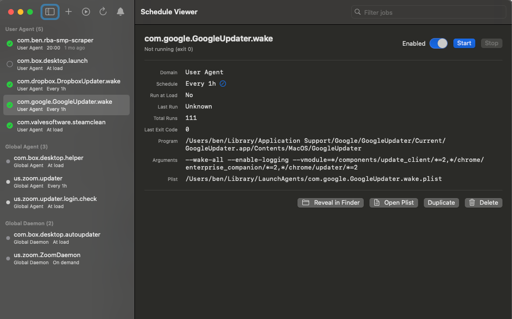

## Vibe Coding a macOS App from RStudio

*30 March 2026*



I read Simon Willison's post on [vibe coding SwiftUI apps](https://simonwillison.net/2026/Mar/27/vibe-coding-swiftui/) a few days ago and immediately wanted to try it. He realised that a full SwiftUI app can fit in a single text file, compiled and run without ever opening Xcode, which is a delightful way to vibe-code simple MacOS utilities. 

### The idea

My Mac has various scheduled jobs running in the background via `launchd` — macOS's system for scheduled tasks, background services, and launch-on-load processes. I have a few personal tools, and the obvious system and app tasks from Dropbox, Google, and so on. Managing these normally means fiddling with XML plist files and `launchctl` terminal commands, which is doable but annoying. I'd prefer a GUI - and wondered if Claude can help me get away with not paying for one. 

### The build

I asked Claude to plan a lightweight SwiftUI app in a single text file — that produces a simple GUI for scheduled processes. Claude explored my system to see what launchd jobs look like, checked what Swift version was available, and put together a plan. I approved the first run, and Claude wrote the entire app and compiled it. Simon's tip is to then get the LLM to suggest features - Claude would plan them, I'd approve, and it would implement and compile. 

### Feature creep 

Over the course of 20 minutes of iteration, the app grew from a basic viewer into something relatively well featured:

- **Monitoring**: auto-refresh on a timer, last-run timestamps derived from log file modification times, live log tailing with a pause button, and macOS notifications when a job fails
- **Editing**: an enable/disable toggle per job, a schedule editor that modifies the plist and reloads the job, a form to create new jobs with a file browser for picking the program, and job duplication
- **Quality of life**: grouped sidebar sections by domain (collapsible), Reveal in Finder and Open Plist buttons, a delete button requiring you to type the job name to confirm, and a menu bar icon for quick access without opening the full window

The whole thing is about 1,200 lines of Swift in a single file, compiling to a ~430KB binary. Claude wrapped it in a proper `.app` bundle so it shows up in Spotlight and can sit in the Dock.

### Testing

To test the app's job creation feature, I used it to create a simple heartbeat job that writes a timestamp to a log file every minute. It worked — the job appeared in the sidebar, I could start it, watch the log file fill up, then disable it with the toggle and confirm it stopped. 

I have no test suites or other QA for this app, but I don't really care, because it's not critical that I get my personal scheduled jobs exactly right. 

### Bugs and bumps

On several iterations there were some inscrutable Swift bugs during compilation (and one during runtime), but Claude picks up the former when builds fail and can iterate, and I just pasted any runtime issues back to Claude. This is a similar build-error-fix loop as with the [F1 timing app](#what-can-claude-one-shot), but smoother because Claude can see compile errors directly in its own context and fix them in place.

### Reflections

A few things stand out:

- **SwiftUI from RStudio works surprisingly well.** The Posit AI beta's ability to run shell commands means compiling Swift is just another tool call. I never opened Xcode or Terminal.
- **Single-file apps are underrated.** No project files, no build system, no dependencies. Just a `.swift` file and `swiftc`. This is smooth and easy, and I think makes the LLMs more reliable.
- **The feature-suggestion pattern is great.** Asking LLMs to suggest features is a great way to discover what's possible, as they know the APIs and frameworks better than I do, and several features (like `DispatchSource` file monitoring for live log tailing) are things I wouldn't have thought to ask for.
- **I don't really know Swift.** Similar to Simon's caveat — I can read it, but I didn't write any of this code, and I'm not well placed to evaluate whether it's doing things optimally under the hood. It works, and it feels solid in use, but the usual vibe coding disclaimers apply.

The source code is on [GitHub](https://github.com/benjackman/ScheduleViewer). As always, it was a lot of fun to go from an idea to a working macOS app in a single session.

---

## Building the Swear Jar

*18 March 2026*


My wife and I have a very young toddler, a baby just past a year old, starting her initially-slow but rapidly accelerating takeoff into English language mastery. She only has a few reliable words in her current vocabulary, but is doing more parroting every day, and even occasionally nails a multiple-syllable sound.

This is obviously extremely cute. But it's also disastrous for a family where the occasional swear word can slip out. We used to tell ourselves we had time to clean up our language before the baby was picking up words, but that time has run out!

This brought on the idea for the [swear jar](https://benjackman.github.io/swearjar/) — a way to remind and train ourselves not to use naughty language in front of the baby, lest she start to teach it to other kids at daycare. A web app seemed like a great way to do this, as it'd be easily accessible for both me and my wife, wherever we are (and easier to make a habit than a physical jar stuck at home).

### Kicking Off

The concept is simple — if we accidentally swear within earshot of the baby, we open the webapp, tap our jar (or the others' jar if we're dobbing them in), and optionally note down our swear word as a fun bit of record-keeping. Each 'coin' in the jar represents a dollar, and every month or so, we'd settle up by transferring the net difference from worst offender to best behaved. (While my wife and I have combined finances, we separate a small pool of 'fun money', which facilitates little notional transfers like this.)

I asked Claude to plan this project, and whether it should go on this personal blog or separately. I said I wanted it free, simple, interactive, but also to preserve state. Claude mulled this over and suggested adding a webapp to this blog, using some simple CSS styling and buttons for interactivity with an emoji for a jar, and using [Supabase's](https://supabase.com/) free tier database hosting. We skipped auth planning (at my request) at this point.

I approved this plan, and Claude got to work, and within about 1 minute the LLM had one shot a single index.qmd with the custom styling and interactivity needed. Claude also provided instructions on the Supabase sign up and free project setup, with a single SQL query to instantiate the required basic tables and set some Supabase settings. After some skeptical quizzing on database security, I also followed Claude's instruction to add a project database key to the index.qmd. (Helpfully, Supabase also makes clear there are specific keys for exactly this purpose, by calling the relevant key "publishable", flagging it can be public in its docs, and literally having "publishable" in the key string — great job Supabase!).

This worked great, and after some testing (and repeated deleting of the test rows in those new Supabase tables), I moved on to some tweaks.

### Auth

Although I thought this would be too hard for such a basic process, Claude's suggestion for a middle ground was to use a 'passphrase' stored in each visitor's LocalStorage, meaning the passphrase would be entered once and access to the Swear Jar would be granted automatically subsequently. This passphrase is hashed in index.qmd. This is secure enough only to stop people idly fiddling with the buttons or accidentally adding swears, but that's good enough for such a niche project. A bruteforce attack could get this passphrase quickly (but that's fine, especially as Supabase's free tier is hard-capped at zero cost, and facilitates regular free backups — great job Supabase!). The nice side effect is that this workflow is not triggered until a new user attempts to interact, so visitors can still see the page, and view our latest swearing indiscretions listed at the bottom.

### Aesthetics

At my request, the first round of the work had no focus on appearances, and so was a little ugly with a lot of what looks like default CSS styling. A very low impact refactor has made things look slightly better, although we're certainly not winning any design awards. A bit more thought went into updating the coin jars away from a default empty jar emoji. Using [Nano Banana](https://gemini.google/overview/image-generation/), I generated a series of cartoon-style jar images in increasing order of fill (from an empty jar all the way to overflowing). Somewhat annoyingly, these popped out as large pngs from Nano Banana, and my request for transparent background was met with fake transparent grid pattern that was actually rendered. Claude fortunately pointed me in the direction of some awesome free tools — [remove.bg](https://www.remove.bg/) (from Canva) and [Squoosh](https://squoosh.app/) (from Google) which gave these images a transparent background and converted them into webp format (and very small — 10s of kbs). Learning about these tools while Claude does most of the grunt work is such a great byproduct of accelerated development of fun side projects.

### Conclusion

My only challenge now is to get my wife to start using the webapp. I've added it her home phone screen as an open-on-web link, with 🤬 as the preview. She is the person I know with the least screen time (sometimes less than 90 minutes per day), but hopefully the idea of our baby swearing like a sailor will be motivation to get her using the swear jar now.

More generally, I imagined this swear jar webapp last night, and now it exists, essentially exactly as I wanted it — free, simple, and shareable without a big risk that someone can fiddle with it accidentally. These large LLMs make fun side projects such a joy — from thought to reality with so much less effort, while learning a lot along the way. We might be in a new golden era of personal websites, which means [the](https://minifeed.net/blogs) [small](https://kagi.com/smallweb/?url=https%3A%2F%2Fcybersalon.org%2Fvort3x-50%2F) [web](https://kevinboone.me/small_web_is_big.html) resurgence is real.

---

## Claude builds an R package

*8 March 2026*


I have access to the [Posit AI beta](#posits-ai-beta), which means I am testing Claude in RStudio.

After earlier experiments with my own Claude Code sessions to build a [Formula 1 timing iOS app](#what-can-claude-one-shot), I wanted to see what Claude could build relating to F1 in RStudio.

### The request and planning

I asked Claude to make an R package that scrapes a public F1 data API and provides it to users of the package in a sensible structured format. (I know the fantastic [f1dataR](https://github.com/SCasanova/f1dataR) package already exists, but it relies on Python via the reticulate package, and I wondered what R could do on its own.)

Opus flew through the planning for this quite quickly (notably faster than for the iOS app, perhaps reflecting the relative simplicity of R packages?). It presented a few naming options, one of which I chose - pitlaneR, since others were a bit more clunky.

One note is that Opus searched for APIs and prompted me to choose an option, which I did, and it immediately ignored this and chose another (although the choice I made was quite a bad one in hindsight). This behaviour is a bit concerning, but worked out positively in this particular case. This is something I'll watch closely in future.Finally, Claude kicked off the process and began generating files.

### The build

Claude in RStudio seems very familiar with the structure of R packages and the general development environment for R development, and chided me for not having usethis already installed on the R instance I was working in (fair enough!). This is good as other (albeit older) frontier LLMs have been a bit flaky on R development in my experience. This could also be because Posit's harness for Claude in the AI beta might be quite R-specific and well built.

The build seemed relatively sensible, and during the process Claude was testing functionality in the R console, which was nice to see. Claude added a bunch of relatively nice features that I did not request - a cache for the API data, and a few tests.

Claude did not start by opening a new RProject file, but directed me to move over to it in RStudio once it had written the files. Upon doing this, a new conversation in Claude was triggered, and the previous context appeared to be wiped, and I couldn't access it easily. This is not a big deal, but does mean spending additional tokens to get a new instance caught up.

### A strong result

Unlike the F1 iOS app, early returns suggest everything Claude made works out of the box, although the work was at times a bit sloppy - like poor documentation, and data issues I'll raise below. The relative success probably just reflects that an R package with a simple data API is simpler and smaller context than an iOS package.

Devtools::check() complained about some minor details (when does it ever not?), with the most notable being some lack of documentation for some functions. I asked the new Claude instance to take a look, it immediately began complaining about its own work, before making some updates which devtools::check begrudgingly accepted. Another few small build notes and warnings will be dealt with later (although this might be a good candidate to get Claude to iterate on, since it can read console output I think).

Basic functionality - like loading data, and things appearing in a relatively sensible format - all appears to work. It is a bit jarring to see what you think of as something you 'created' returning formatting you would never use, but I guess this is the new normal now. The API caching also works perfectly.

### Some weaknesses

I tested the f1_qualifying() function first (in part because I was curious about [this question](https://old.reddit.com/r/formula1/comments/1rn6vt5/is_this_the_most_stacked_q1_elimination_ever/)). The function returned nothing for years prior to 1994, and upon asking Opus why, it explained the API does not have data for these years (and said that filling it in would have to be a web scraping effort), but it did not document this when producing the function. I asked it to add appropriate guard handling, documentation and tests which it did.

This really highlights that a one-shot agent can do a lot, but won't think carefully about the limitations of the data or edge cases that it goes through. But this is also something that could be caught with some detailed test-driven development workflows beforehand. I can't really complain though, since I specified nothing!

This also tells me next steps for this package is to get Opus to write a pretty sizeable test suite, as part of a process of testing the functions themselves. I've published the [package code on Github](https://github.com/benjackman/pitlaneR), with suitable warnings about AI authorship. You can also see Claude's [first attempt at a vignette](https://benjackman.github.io/pitlaneR/articles/pitlaneR.html) (also with warnings I've added).

### Takeaways

- This is miraculous, but as is always the case with technological change, somehow also feels more and more normal as I use these tools everyday. I should remind myself every now and then just how bonkers this really is.
- Claude can output pretty great boilerplate R package code, but as always with AI development - careful attention must be paid to what it produces.
- Testing and documentation should be easier (but still verified). Claude one-shotted a good looking vignette - including with the new f1_qualifying limit.
- Finally, this is a lot of fun. Thanks again to our friends at Posit.

---

## What can Claude one-shot?

*7 March 2026*

Claude's abilities, especially when powered by the Opus 4.6 model, are quite strong. I have been surprised by the model's ability to complete complex tasks with limited direction. So I set out to test the default Claude Code settings in an empty folder to see how far a complicated project can get when you just let it run.

The tradeoff here is pretty clear. More complex projects are great in theory - let an agent work independently to build something substantial. But they're also where LLMs start to lose track as context bloats and complexity grows, and can even lead to model collapse. I've heard that more detailed strategies and model handholding can reportedly improve this performance, but I was curious what we can achieve "out of the box".

### Getting started

I followed a simple model: ask Opus to plan an app with basic instructions, then execute, including using subagents. Specifically, I asked for a Formula 1 calendar app that scrapes public APIs for F1 session times, presents them in an app available on iOS or Mac, has widgets to place on home screens, and sends notifications ahead of session starts - all with the usual user customisation options.

Going in, I'd say I had limited faith it could one-shot something perfectly - particularly because it's not set up to be able to run Swift code itself, so it can't interactively test the code during the attempt. 

I kicked off Claude Opus on this yesterday evening. The planning process began, and Opus spent a significant amount of time working through various API options, and appearing to think about other aspects of the app development. The planning process ended with several interactive questions from Claude about details, including which specific additional features to include, and some simple design spec questions. It then suggested I kick off the build.


As a side note, there wasn't an obvious way to switch from Opus to Sonnet before telling Opus to start the build. And the planning process was already quite token intensive, and as a result, as Sonnet began working I immediately ran into a Claude Pro token limit (I wasn't using the [Posit AI beta](https://benjackman.github.io/tinkering/#posits-ai-beta) for this one - tokens my own!). I restarted with Sonnet the following morning and it finished Opus' plan.

### Claude's output

Claude didn't have the tools to set up an Xcode project properly, so I had to follow a setup.md file with instructions to properly initiate everything. This was particularly confusing - although I have some passing familiarity with Swift, I have none with Xcode, and it has a bunch of fiddly settings that are tricky to deal with at first. Nonetheless, 20 minutes of back and forth with Claude, including sending screenshots, and things were set up in a way that at least seems correct. Claude appeared to hallucinate some image contents at one point, but by chance this setting was already correct anyway. Stay skeptical!

::: {.callout-note title="Lesson"}
Setup an Xcode project first for the LLM, and learn some sensible Xcode setting defaults to pre-specify.
:::

### The build-error-edit-build loop

Perhaps unsurprisingly, Claude did not one-shot an app that built on first try. This started an iteration where I would attempt a build in Xcode, see the error, screenshot it, and paste it to Claude, who would edit the files in place and tell me to build again. An obvious question here is whether some Xcode, Swift or Claude Code tool would allow Claude to run these build attempts itself and parse the output. 


This loop happened several times over, with new errors happening each time, and my faith in Claude's effort started to dim. Perhaps I had been too ambitious. But...

### Success!

After 6 error screenshots, the 7th attempt to build was successful. Xcode loaded the iPhone 16 Pro preview pane, and we see something quite nice: 


This app actually appears to work in preview - the times pulled from the OpenF1 API are correct, the countdown timing is correct (as I write this I'm watching the Aus GP Q3), the navigation works, the user control flow to not show various types of sessions works, etc. That said, I haven't tested it in full yet. 

### This is kind of crazy
I imagined a small, lightweight F1 app that I'd find handy. I told a large language model through a chat interface to plan it out and build it. I did not touch a single line of code, just fiddled with some IDE settings and permissions and told it about some errors. After 7 build attempts, it actually appears to work. I have read about this sort of performance, but seeing it happen first hand is quite disorienting. This would be ridiculous science fiction just a few years ago! Of course, a vibe-coded iPhone app could be full of low quality, brittle, and unsafe code. I'll take a look under the hood and see what Opus and Sonnet have cooked up. But the fact this works at all is remarkable. 

### Next steps

Let's test the app properly, and learn how to load a local iOS app onto a personal iPhone. 


---

## Animating the AGS Yield Curve

*6 March 2026*

A couple of years ago, several of my RBA colleagues and I worked to bring back the RBA's publication of daily Australian Government Securities (AGS) bond yields. This was the return of RBA Statistical Table F16 ([found here](https://www.rba.gov.au/statistics/tables/)), which for a time had not been available.

We're very happy to be able to continue publishing this data - it's a great resource, available to the public for free, enabling all kinds of nifty analysis and visualisation. 

With a bit of R Code, we can visualise the last decade of the AGS yield curve (below), highlighting some of the big macro events. We can see the yield curve slowly drift down through the late 2010s, the sharp decline as the pandemic begins in March 2020, the clear kink in the curve due to the RBA's Yield Target through 2020 and 2021, and the subsequent lift in the curve as interest rates have risen. 

The plot below is monthly, but as the data is daily even more detailed visualisations would be possible. The R code for generating this gif is included below. (Note I used Simon Willison's excellent [gif-optimizer](https://tools.simonwillison.net/gif-optimizer) tool to reduce the file size of the gif outputted by the code below by about 70%.)

```{=html}
<div style="text-align: center; position: relative; display: inline-block; width: 100%;">
  
  <div id="yield-curve-overlay" style="position: absolute; top: 0; left: 0; width: 100%; height: 100%; display: flex; align-items: center; justify-content: center;">
    <button id="yield-curve-btn" onclick="playYieldCurve()" style="padding: 12px 24px; font-size: 16px; cursor: pointer; background: rgba(255,255,255,0.85); border: 1px solid #ccc; border-radius: 6px;">
      ▶ Play
    </button>
  </div>
</div>

<script>
function playYieldCurve() {
  var img = document.getElementById('yield-curve');
  var btn = document.getElementById('yield-curve-btn');
  // Reload GIF with cache-bust to restart from frame 1
  img.src = 'ags_yield_curve.gif?' + new Date().getTime();
  btn.style.display = 'none';
  // GIF is 582 frames at 10fps = ~58.2s, show button again after
  setTimeout(function() {
    img.src = 'ags_yield_curve_poster.png';
    btn.style.display = 'inline-block';
  }, 58500);
}
</script>
```

<details>
<summary>Show R code</summary>

```r
library(readrba)
library(tidyverse)
library(scales)
library(magick)

# Download RBA F16 - Australian Government Securities yields
f16 <- read_rba(table_no = "f16")

# Filter to nominal Treasury Bonds only (exclude inflation-linked)
bonds <- f16 |>
  filter(series == "Treasury Bond") |>
  mutate(
    maturity_date = lubridate::dmy(str_extract(description, "\\d{2}-[A-Za-z]+-\\d{4}")),
    years_to_maturity = as.numeric(maturity_date - date) / 365.25
  )

# Downsample to weekly snapshots
bonds_weekly <- bonds |>
  mutate(yw = lubridate::floor_date(date, "week")) |>
  group_by(yw, series_id, description, maturity_date) |>
  slice_max(date, n = 1) |>
  ungroup()

# Keep only bonds not yet matured and weeks with enough bonds to draw a curve
anim_data <- bonds_weekly |>
  filter(
    years_to_maturity > 0,
    yw >= as.Date("2015-01-01")
  ) |>
  group_by(yw) |>
  filter(n() >= 3) |>
  ungroup()

weeks <- sort(unique(anim_data$yw))
y_max <- ceiling(max(anim_data$value, na.rm = TRUE))

# Number of trailing weeks to show as fading ghost trails
n_trail <- 6

# Render each week as a PNG frame, then stitch with magick
tmp_dir <- tempfile()
dir.create(tmp_dir)

line_col <- "#5B9BD5"

for (i in seq_along(weeks)) {
  w <- weeks[i]

  trail_indices <- seq(max(1, i - n_trail), max(1, i - 1))
  trail_layers <- list()
  for (j in trail_indices) {
    age <- i - j
    alpha <- 0.10 + 0.10 * (n_trail - age) / n_trail
    trail_df <- filter(anim_data, yw == weeks[j])
    trail_layers <- c(trail_layers, list(
      geom_line(data = trail_df, color = line_col, linewidth = 0.5, alpha = alpha),
      geom_point(data = trail_df, color = line_col, size = 0.8, alpha = alpha)
    ))
  }

  current_df <- filter(anim_data, yw == w)

  p <- ggplot(current_df, aes(x = years_to_maturity, y = value)) +
    trail_layers +
    geom_line(color = line_col, linewidth = 0.8) +
    geom_point(color = line_col, size = 1.5) +
    labs(
      title = "Australian Government Bond Yield Curve",
      subtitle = format(w, "%d %B %Y"),
      x = "Years to Maturity",
      y = "Yield (% p.a.)",
      caption = "Source: RBA Statistical Table F16"
    ) +
    scale_x_continuous(limits = c(0, 32), breaks = seq(0, 30, by = 5)) +
    scale_y_continuous(limits = c(0, y_max), labels = label_number(suffix = "%")) +
    theme_minimal(base_size = 14) +
    theme(
      plot.title = element_text(face = "bold"),
      panel.grid.minor = element_blank(),
      panel.border = element_rect(color = "grey80", fill = NA, linewidth = 0.5)
    )

  ggsave(
    filename = file.path(tmp_dir, sprintf("frame_%04d.png", i)),
    plot = p, width = 8, height = 5, dpi = 100
  )
}

# Stitch frames into a GIF
frames <- image_read(list.files(tmp_dir, full.names = TRUE))
gif <- image_animate(frames, fps = 10)
image_write(gif, "ags_yield_curve.gif")
```

</details>

---

## Posit's AI Beta

*3 March 2026*

Posit is currently running a private beta test of its AI product for RStudio, powered by Claude under the hood. I was lucky enough to receive an invite and have been tinkering with it as a result. The integration is in a new left-hand pane, like you can see in the image below.


Even as someone relatively bullish on AI's potential for software and data science, having Claude integrated directly into the RStudio IDE has been better than I expected. It can view files in the workspace, understand relevant context, and edit files, all relatively seamlessly. And this extends to built-in tools like bash commands, which means Claude can render Quarto documents and sites (like this one!), check files in folders, and more.

But more so, the RStudio integration seems quite thoughtful. Claude's use of tools and deletions is helpfully controlled with the user via the AI pane within RStudio, with interactive checks that allow you to deny, approve, or 'approve all for this project' of a given tool. This gives you the right level of control depending on your use case. Below is an example of Claude's workflow for rejecting tool use in the AI pane.


Having used AI tools for R coding before, it's the tooling (not just the model) that makes a big difference over existing options. Having context immediately available and in-line tooling is a meaningful step up. For me, this feels like a significant improvement even over GitHub Copilot editing R files in VS Code.

Next steps in my testing for this tooling will include more detailed R package development, as well as heavier data tasks like visualisation and running complex data workflows involving modelling.

I also wonder whether Posit will allow different models to be integrated into the harness, which could improve compatibility across enterprise environments served by AI providers other than Anthropic.

Regardless, thanks to Posit for producing this great product. It's a credit to their team, and I can't wait to keep using it even after the private beta. Thanks also to my new R coding buddy - this post benefited from Claude's helpful edits.

---

## Plotting Runs with Strava Calendar

*3 January 2021*

I use Strava for logging my running. It's a great tool (particularly all the free functionality!), and over the last few years I've built up a reasonable database of my runs.

Some years ago, [Colin Carroll](https://colindcarroll.com/) created a nifty Python package for simple visualisations of Strava exercises in calendar format. It's the aptly named [Strava Calendar](https://github.com/ColCarroll/strava_calendar). Colin actively monitors this repo and recently added automatic support for .gpx files, which Strava now provides if you request all your data.

This package gives out-of-the-box support for great visualisations. Here are all my runs in February 2019:


The first run is my attempt at the [Cole Classic Sun Run](https://sunruncoleclassic.com.au/). The 4 similar looking runs with loops in their top-right corners (Feb 4, 6, 20 and 27) are Sydney's [Corporate Cup](http://www.sydneycorporatecup.org.au/) course - starting in the Domain, past the Botanic Gardens, and looping around Mrs Macquarie's Chair on Sydney Harbour. A few other runs are thrown in there for good measure.

Paired with more metadata provided by Strava, these little calendars become like little exercise diaries. I had a great time going back and thinking about some of the context from these UK runs:


In October 2019 I had just arrived for study. The runs include some early London jogs in Stoke Newington (home of everyone's favourite [Penny Farthing crash](https://youtu.be/4zdASvSTCe8?t=11)), and my first run in Oxford. I've also popped in some of my notes from the Strava run titles - about my back feeling a bit better allowing a few runs in a row, and a typically Australian complaint about the weather.

The package also includes a default `plot_calendar()` function, which spits out a full calendar year. For some reason I had trouble getting it to run for 2019 and 2020 (and so raised a quick [Github Issue](https://github.com/ColCarroll/strava_calendar/issues/5)), but it works fine for 2018. You can see the complete stoppage as a result of my bad ankle injury in late March of 2018, my two attempts to come back to running in late May and July, before things finally get going again in September.


These images (and similar images I might develop in future) would be a great addition to travel diaries, or a 'year in review' style post. I intend to keep playing around with Strava Calendar and producing more interesting diagrams. I'm grateful to Colin for building such a simple and enjoyable tool.
