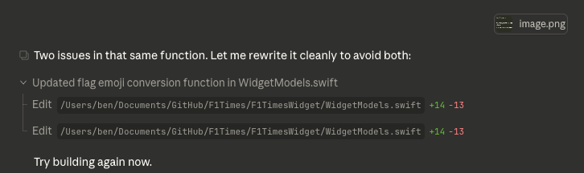
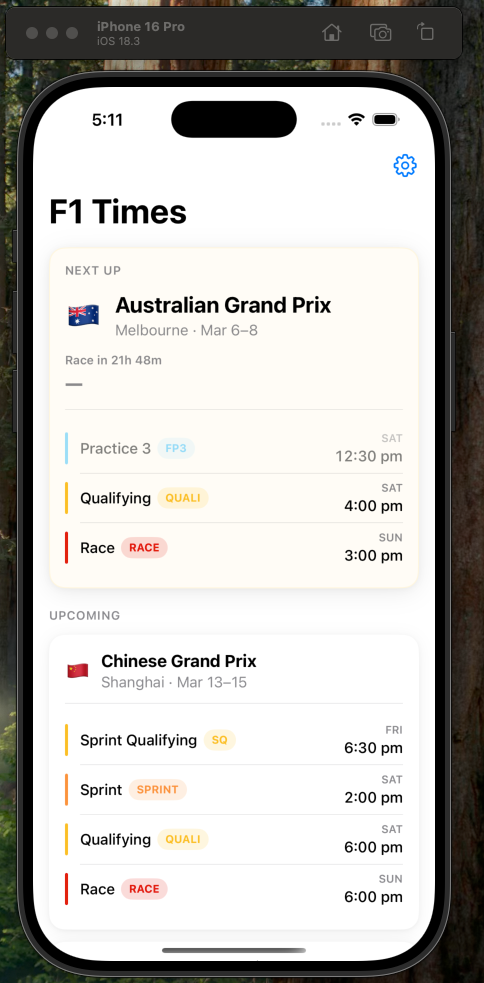
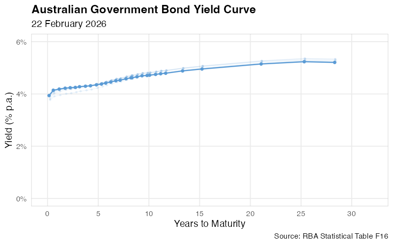
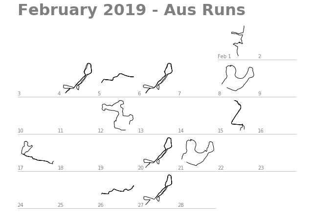
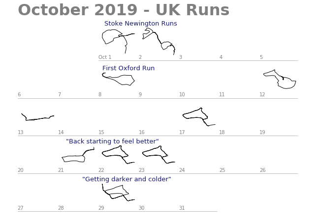
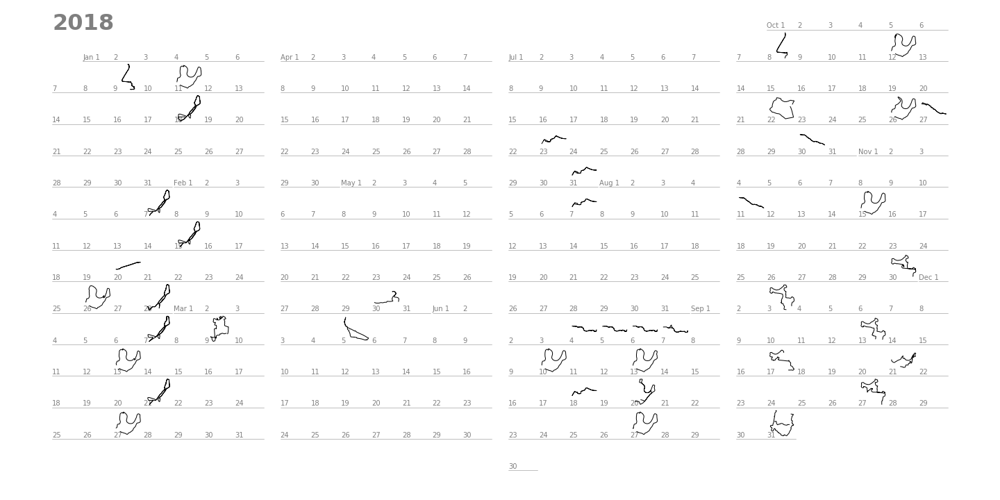

## What can Claude one-shot?

*7 March 2026*

Claude's abilities, especially when powered by the Opus 4.6 model, are quite strong. I have been surprised by the model's ability to complete complex tasks with limited direction. So I set out to test the default Claude Code settings in an empty folder to see how far a complicated project can get when you just let it run.

The tradeoff here is pretty clear. More complex projects are where models shine unsupervised - give it enough to work on and it can build something substantial. But they're also where LLMs start to lose track as context bloats, and can even undergo something like model collapse. More detailed strategies and model handholding can reportedly improve this performance, but I was curious what "out of the box" can achieve.

### Setup

I followed a simple model: ask Opus to plan an app with basic instructions, then execute, including using subagents. Specifically, I asked for a Formula 1 calendar app that scrapes public APIs for F1 session times, presents them in an app available on iOS or Mac, has widgets to place on home screens, and sends notifications ahead of session starts - all with the usual user customisation options.

Going in, I'd say I had limited faith it could one-shot something perfectly - particularly because it's not set up to be able to run Swift code itself, so it can't interactively test the code during the attempt. 

I kicked off Claude Opus on this yesterday evening. The planning process began, and Opus spent a significant amount of time working through various API options, and appearing to think about other aspects of the app development. The planning process ended with several interactive questions from Claude about details, including which specific additional features to include, and some simple design spec questions. It then suggested I kick off the build.


As a side note, there wasn't an obvious way to switch from Opus to Sonnet before telling Opus to start the build. And the planning process was already quite token intensive, and as a result, as Sonnet began working I immediately ran into a Claude Pro token limit (I wasn't using the [Posit AI beta](https://benjackman.github.io/tinkering/#posits-ai-beta) for this one - tokens my own!). I restarted with Sonnet the following morning and it finished Opus' plan.

### Getting started

Claude didn't have the tools to set up an Xcode project properly, so I had to follow a setup.md file with instructions to properly initiate everything. This was particularly confusing - although I have some passing familiarity with Swift, I have none with Xcode, and it has a bunch of fiddly settings that are tricky to deal with at first. Nonetheless, 20 minutes of back and forth with Claude, including sending screenshots, and things were set up in a way that at least seems correct. Claude appeared to hallucinate some image contents at one point, but by chance this setting was already correct anyway. Stay skeptical!

::: {.callout-note title="Lesson"}
Setup an Xcode project first for the LLM, and learn some sensible Xcode setting defaults to pre-specify.
:::

### The build-error-edit-build loop

Perhaps unsurprisingly, Claude did not one-shot an app that built on first try. This started an iteration where I would attempt a build in Xcode, see the error, screenshot it, and paste it to Claude, who would edit the files in place and tell me to build again. An obvious question here is whether some Xcode, Swift or Claude Code tool would allow Claude to run these build attempts itself and parse the output. 



This loop happened several times over, with new errors happening each time, and my faith in Claude's effort started to dim. Perhaps I had been too ambitious. But...

### Some success

After 6 error screenshots, the 7th attempt to build was successful. Xcode loaded the iPhone 16 Pro preview pane, and we see something quite nice: 



This app actually appears to work in preview - the times pulled from the OpenF1 API are correct, the countdown timing is correct (as I write this I'm watching the Aus GP Q3), the navigation works, the user control flow to not show various types of sessions works, etc. That said, I haven't tested it in full yet. 

### This is kind of crazy
I imagined a small, lightweight F1 app that I'd find handy. I told a large language model through a chater interface to plan it out and build it. I did not touch a single line of code, just fiddled with some IDE settings and permissions and told it about some errors. After 7 build attempts, it actually appears to work. I have read about this sort of performance, but seeing it happen first hand is quite disorienting. This would be ridiculous science fiction just a few years ago! Of course, a vibe-coded iPhone app could be garbage quality, bloated, brittle, and unsafe code. I'll take a look under the hood and see what Opus and Sonnet have cooked up. But the fact this works at all is remarkable. 

### Next steps

Let's test the app properly, and learn how to load a local iOS app onto a personal iPhone. 


---

## Animating the AGS Yield Curve

*6 March 2026*

A couple of years ago, several of my RBA colleagues and I worked to bring back the RBA's publication of daily Australian Government Securities (AGS) bond yields. This was the return of RBA Statistical Table F16 ([found here](https://www.rba.gov.au/statistics/tables/)), which for a time had not been available.

We're very happy to be able to continue publishing this data - it's a great resource, available to the public for free, enabling all kinds of nifty analysis and visualisation. 

With a bit of R Code, we can visualise the last decade of the AGS yield curve (below), highlighting some of the big macro events. We can see the yield curve slowly drift down through the late 2010s, the sharp decline as the pandemic begins in March 2020, the clear kink in the curve due to the RBA's Yield Target through 2020 and 2021, and the subsequent lift in the curve as interest rates have risen. 

The plot below is monthly, but as the data is daily even more detailed visualisations would be possible. The R code for generating this gif is included below. (Note I used Simon Willison's excellent [gif-optimizer](https://tools.simonwillison.net/gif-optimizer) tool to reduce the file size of the gif outputted by the code below by about 70%.)

```{=html}
<div style="text-align: center; position: relative; display: inline-block; width: 100%;">
  
  <div id="yield-curve-overlay" style="position: absolute; top: 0; left: 0; width: 100%; height: 100%; display: flex; align-items: center; justify-content: center;">
    <button id="yield-curve-btn" onclick="playYieldCurve()" style="padding: 12px 24px; font-size: 16px; cursor: pointer; background: rgba(255,255,255,0.85); border: 1px solid #ccc; border-radius: 6px;">
      ▶ Play
    </button>
  </div>
</div>

<script>
function playYieldCurve() {
  var img = document.getElementById('yield-curve');
  var btn = document.getElementById('yield-curve-btn');
  // Reload GIF with cache-bust to restart from frame 1
  img.src = 'ags_yield_curve.gif?' + new Date().getTime();
  btn.style.display = 'none';
  // GIF is 582 frames at 10fps = ~58.2s, show button again after
  setTimeout(function() {
    img.src = 'ags_yield_curve_poster.png';
    btn.style.display = 'inline-block';
  }, 58500);
}
</script>
```

<details>
<summary>Show R code</summary>

```r
library(readrba)
library(tidyverse)
library(scales)
library(magick)

# Download RBA F16 - Australian Government Securities yields
f16 <- read_rba(table_no = "f16")

# Filter to nominal Treasury Bonds only (exclude inflation-linked)
bonds <- f16 |>
  filter(series == "Treasury Bond") |>
  mutate(
    maturity_date = lubridate::dmy(str_extract(description, "\\d{2}-[A-Za-z]+-\\d{4}")),
    years_to_maturity = as.numeric(maturity_date - date) / 365.25
  )

# Downsample to weekly snapshots
bonds_weekly <- bonds |>
  mutate(yw = lubridate::floor_date(date, "week")) |>
  group_by(yw, series_id, description, maturity_date) |>
  slice_max(date, n = 1) |>
  ungroup()

# Keep only bonds not yet matured and weeks with enough bonds to draw a curve
anim_data <- bonds_weekly |>
  filter(
    years_to_maturity > 0,
    yw >= as.Date("2015-01-01")
  ) |>
  group_by(yw) |>
  filter(n() >= 3) |>
  ungroup()

weeks <- sort(unique(anim_data$yw))
y_max <- ceiling(max(anim_data$value, na.rm = TRUE))

# Number of trailing weeks to show as fading ghost trails
n_trail <- 6

# Render each week as a PNG frame, then stitch with magick
tmp_dir <- tempfile()
dir.create(tmp_dir)

line_col <- "#5B9BD5"

for (i in seq_along(weeks)) {
  w <- weeks[i]

  trail_indices <- seq(max(1, i - n_trail), max(1, i - 1))
  trail_layers <- list()
  for (j in trail_indices) {
    age <- i - j
    alpha <- 0.10 + 0.10 * (n_trail - age) / n_trail
    trail_df <- filter(anim_data, yw == weeks[j])
    trail_layers <- c(trail_layers, list(
      geom_line(data = trail_df, color = line_col, linewidth = 0.5, alpha = alpha),
      geom_point(data = trail_df, color = line_col, size = 0.8, alpha = alpha)
    ))
  }

  current_df <- filter(anim_data, yw == w)

  p <- ggplot(current_df, aes(x = years_to_maturity, y = value)) +
    trail_layers +
    geom_line(color = line_col, linewidth = 0.8) +
    geom_point(color = line_col, size = 1.5) +
    labs(
      title = "Australian Government Bond Yield Curve",
      subtitle = format(w, "%d %B %Y"),
      x = "Years to Maturity",
      y = "Yield (% p.a.)",
      caption = "Source: RBA Statistical Table F16"
    ) +
    scale_x_continuous(limits = c(0, 32), breaks = seq(0, 30, by = 5)) +
    scale_y_continuous(limits = c(0, y_max), labels = label_number(suffix = "%")) +
    theme_minimal(base_size = 14) +
    theme(
      plot.title = element_text(face = "bold"),
      panel.grid.minor = element_blank(),
      panel.border = element_rect(color = "grey80", fill = NA, linewidth = 0.5)
    )

  ggsave(
    filename = file.path(tmp_dir, sprintf("frame_%04d.png", i)),
    plot = p, width = 8, height = 5, dpi = 100
  )
}

# Stitch frames into a GIF
frames <- image_read(list.files(tmp_dir, full.names = TRUE))
gif <- image_animate(frames, fps = 10)
image_write(gif, "ags_yield_curve.gif")
```

</details>

---

## Posit's AI Beta

*3 March 2026*

Posit is currently running a private beta test of its AI product for RStudio, powered by Claude under the hood. I was lucky enough to receive an invite and have been tinkering with it as a result. The integration is in a new left-hand pane, like you can see in the image below.


Even as someone relatively bullish on AI's potential for software and data science, having Claude integrated directly into the RStudio IDE has been better than I expected. It can view files in the workspace, understand relevant context, and edit files, all relatively seamlessly. And this extends to built-in tools like bash commands, which means Claude can render Quarto documents and sites (like this one!), check files in folders, and more.

But more so, the RStudio integration seems quite thoughtful. Claude's use of tools and deletions is helpfully controlled with the user via the AI pane within RStudio, with interactive checks that allow you to deny, approve, or 'approve all for this project' of a given tool. This gives you the right level of control depending on your use case. Below is an example of Claude's workflow for rejecting tool use in the AI pane.


Having used AI tools for R coding before, it's the tooling (not just the model) that makes a big difference over existing options. Having context immediately available and in-line tooling is a meaningful step up. For me, this feels like a significant improvement even over GitHub Copilot editing R files in VS Code.

Next steps in my testing for this tooling will include more detailed R package development, as well as heavier data tasks like visualisation and running complex data workflows involving modelling.

I also wonder whether Posit will allow different models to be integrated into the harness, which could improve compatibility across enterprise environments served by AI providers other than Anthropic.

Regardless, thanks to Posit for producing this great product. It's a credit to their team, and I can't wait to keep using it even after the private beta. Thanks also to my new R coding buddy - this post benefited from Claude's helpful edits.

---

## Plotting Runs with Strava Calendar

*3 January 2021*

I use Strava for logging my running. It's a great tool (particularly all the free functionality!), and over the last few years I've built up a reasonable database of my runs.

Some years ago, [Colin Carroll](https://colindcarroll.com/) created a nifty Python package for simple visualisations of Strava exercises in calendar format. It's the aptly named [Strava Calendar](https://github.com/ColCarroll/strava_calendar). Colin actively monitors this repo and recently added automatic support for .gpx files, which Strava now provides if you request all your data.

This package gives out-of-the-box support for great visualisations. Here are all my runs in February 2019:



The first run is my attempt at the [Cole Classic Sun Run](https://sunruncoleclassic.com.au/). The 4 similar looking runs with loops in their top-right corners (Feb 4, 6, 20 and 27) are Sydney's [Corporate Cup](http://www.sydneycorporatecup.org.au/) course - starting in the Domain, past the Botanic Gardens, and looping around Mrs Macquarie's Chair on Sydney Harbour. A few other runs are thrown in there for good measure.

Paired with more metadata provided by Strava, these little calendars become like little exercise diaries. I had a great time going back and thinking about some of the context from these UK runs:



In October 2019 I had just arrived for study. The runs include some early London jogs in Stoke Newington (home of everyone's favourite [Penny Farthing crash](https://youtu.be/4zdASvSTCe8?t=11)), and my first run in Oxford. I've also popped in some of my notes from the Strava run titles - about my back feeling a bit better allowing a few runs in a row, and a typically Australian complaint about the weather.

The package also includes a default `plot_calendar()` function, which spits out a full calendar year. For some reason I had trouble getting it to run for 2019 and 2020 (and so raised a quick [Github Issue](https://github.com/ColCarroll/strava_calendar/issues/5)), but it works fine for 2018. You can see the complete stoppage as a result of my bad ankle injury in late March of 2018, my two attempts to come back to running in late May and July, before things finally get going again in September.



These images (and similar images I might develop in future) would be a great addition to travel diaries, or a 'year in review' style post. I intend to keep playing around with Strava Calendar and producing more interesting diagrams. I'm grateful to Colin for building such a simple and enjoyable tool.
